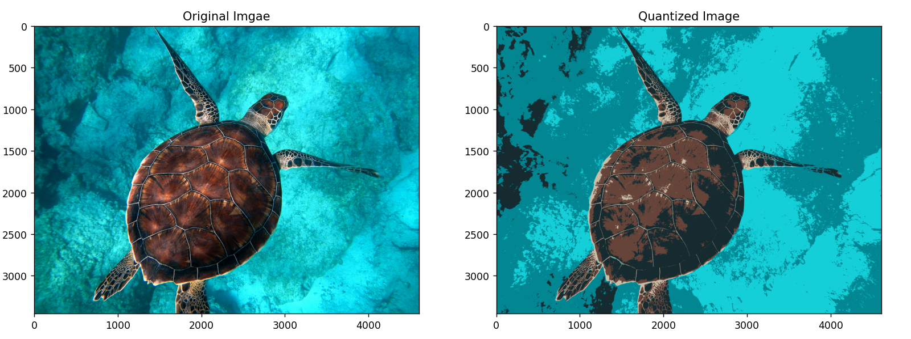
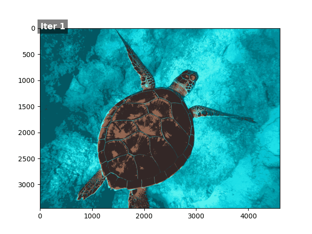
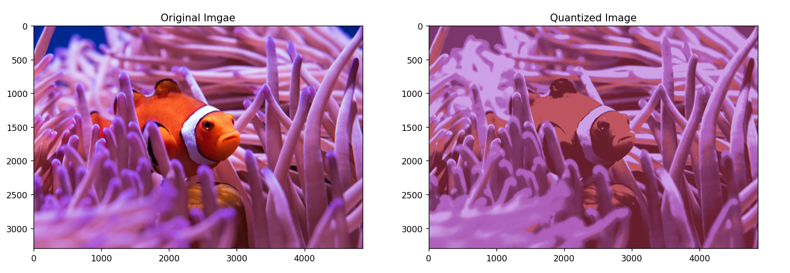

<div align="center">

# 🎨 K-Means Image Quantizer

**Image colour quantization powered by K-Means clustering, implemented from scratch in NumPy.**

[](https://www.python.org/)
[](https://numpy.org/)
[](https://fastapi.tiangolo.com/)
[](https://streamlit.io/)
[](#)

[Live Demo](#-live-demo) • [Features](#-features) • [How It Works](#-how-it-works) • [Setup](#️-running-locally) • [API](#-api-usage)

</div>

---

## 📖 Overview

This project takes an RGB image, treats each pixel as a point in 3-dimensional colour space, clusters those points into a user-defined number of colours using a **hand-built K-Means implementation**, and reconstructs the image using the learned centroids.

It began as a from-scratch algorithm exercise and grew into a full web application — a **FastAPI backend** serving the clustering logic, paired with a **Streamlit frontend** for interactive use.

---

## 🚀 Live Demo

| Resource | Link |
|---|---|
| 🧑‍💻 GitHub | [github.com/Prabhatl0dhi](https://github.com/Prabhatl0dhi) |
| 🌐 Streamlit App | |
| ⚙️ FastAPI Backend ||

---

## 🖼️ Demo

### Original vs. Quantized

<p align="center">
  
</p>

<p align="center"><em>The original image reconstructed using a reduced colour palette learned by K-Means.</em></p>

<br>

### K-Means Iterations in Motion

<p align="center">
  
</p>

<p align="center"><em>Watch the reconstructed image sharpen as centroids update across iterations.</em></p>

<br>

### Another Result

<p align="center">
  
</p>

---

## ✨ Features

- 🧮 K-Means clustering implemented **entirely from scratch**
- 🎨 RGB image quantization with a configurable colour count
- 🔁 Configurable number of K-Means iterations
- ⚡ NumPy broadcasting for fast, vectorized distance computation
- 🔌 FastAPI backend serving the quantization algorithm
- 🖥️ Streamlit frontend for interactive use
- 🖼️ Supports JPG, JPEG, and PNG images
- 🔍 Side-by-side visual comparison of original vs. quantized output

---

## 🧠 How It Works

An RGB image has shape `Height × Width × 3`, where each pixel is a 3-channel colour value:

```
[R, G, B]  →  e.g. [120, 45, 200]
```

Every pixel is therefore just a **point in 3D RGB space**. The image is reshaped from `(H, W, 3)` to `(H × W, 3)` so K-Means can treat every pixel as an independent data point.

### The K-Means Pipeline

<table>
<tr><td width="40"><b>1</b></td><td>

**Initialize Centroids** — `K` random pixels are chosen as the initial cluster centres.
```
K = 4  →  4 randomly selected [R, G, B] centroids
```

</td></tr>
<tr><td><b>2</b></td><td>

**Assign Pixels to Clusters** — Euclidean distance is computed between every pixel and every centroid; each pixel joins the nearest one.
```
distance = ||pixel - centroid||
```

</td></tr>
<tr><td><b>3</b></td><td>

**Update Centroids** — Each centroid is recalculated as the mean RGB value of the pixels assigned to it.
```
new_centroid = mean(pixels in cluster)
```

</td></tr>
<tr><td><b>4</b></td><td>

**Repeat** — Steps 2–3 run for a fixed number of iterations.
```
K = 32, iterations = 5
→ represents the image with 32 colours over 5 refinement passes
```

</td></tr>
<tr><td><b>5</b></td><td>

**Reconstruct the Image** — Every pixel is replaced with its assigned centroid's colour.
```
[124, 83, 201]  →  centroid [120, 80, 195]  →  reconstructed pixel [120, 80, 195]
```

</td></tr>
</table>

The result: the same image, expressed with a much smaller colour palette.

---

## 🏗️ Application Architecture

```
                 User
                   │
                   ▼
        ┌───────────────────-─┐
        │  Streamlit Frontend │
        └──────────┬──────────┘
                   │  HTTP POST
                   ▼
        ┌───────────────────-─┐
        │   FastAPI Backend   │
        └──────────┬──────────┘
                   │
                   ▼
        ┌───────────────────-─┐
        │   K-Means Engine    │
        └──────────┬──────────┘
                   │
                   ▼
           Quantized Image
                   │
                   ▼
     Rendered back in Streamlit
```

---

## 💻 How to Use

### Option 1 — Use the Live Application

1. Open the deployed Streamlit app.
2. Upload a JPG, JPEG, or PNG image.
3. Select the desired number of colours.
4. Select the number of K-Means iterations.
5. Click **Quantize Image**.
6. Wait for processing to finish.
7. Compare the original and quantized results.

### Option 2 — Run Locally

**1. Clone the repository**
```bash
git clone https://github.com/Prabhatl0dhi/kmeans-image-quantizer.git
cd kmeans-image-quantizer
```

**2. Create a virtual environment**

<details>
<summary>Windows</summary>

```bash
python -m venv venv
venv\Scripts\activate
```
</details>

<details>
<summary>Linux / macOS</summary>

```bash
python3 -m venv venv
source venv/bin/activate
```
</details>

**3. Install dependencies**
```bash
pip install -r requirements.txt
```

**4. Start the FastAPI backend**
```bash
uvicorn backend.main:app --reload
```
The API runs at `http://127.0.0.1:8000`, with interactive Swagger docs at `http://127.0.0.1:8000/docs`.

**5. Start the Streamlit frontend** (in a new terminal)
```bash
streamlit run app.py
```
Streamlit will open at `http://localhost:8501`.

---

## 🔌 API Usage

**Endpoint:** `POST /quantize`

| Parameter | Type | Description | Example |
|---|---|---|---|
| `image` | file | JPG, JPEG, or PNG image to quantize | — |
| `n_colours` | int | Number of representative colours to generate | `32` |
| `max_iter` | int | Number of K-Means iterations to run | `5` |

**Returns:** the reconstructed image as `image/png`

---

## 📊 Example Configuration

```
Number of colours: 32
Iterations:        5
```

- ⬆️ More colours → preserves more visual detail, less compression
- ⬆️ More iterations → better-converged centroids, more computation time

---

## ⚠️ Limitations

- Operates directly in RGB colour space (not perceptually uniform)
- Random centroid initialization can affect final results
- Large images require significant memory and compute
- More colours → larger distance matrix
- Fixed iteration count rather than convergence-based stopping
- Primarily a learning/demonstration project, not production-optimized


## 🎯 Motivation

This project started as an attempt to understand K-Means clustering beyond simply calling a library function. The algorithm was implemented from scratch first, then applied to RGB image quantization.

During development, naive nested loops for nearest-centroid assignment proved too slow — replacing them with **NumPy broadcasting** was the key optimization that made the pipeline practical. From there, the project grew beyond a notebook into a full application with a FastAPI backend and Streamlit frontend.

```
K-Means Algorithm → From-Scratch Implementation → RGB Quantization
   → NumPy Vectorization → FastAPI Serving → Streamlit Frontend → Deployment
```

The goal was never just to implement K-Means — it was to **understand it, apply it, optimize it, and ship it.**

## 📌 Key Learning

This project demonstrates how a machine learning algorithm can move beyond an experimental notebook and become part of a real, usable application:

```
Data → Algorithm → Optimization → Application Logic → API → Frontend → User
```

---

## 👨‍💻 Author

**Prabhat Kumar**
B.Tech Computer Science and Engineering (AI & ML)

[](https://github.com/Prabhatl0dhi)